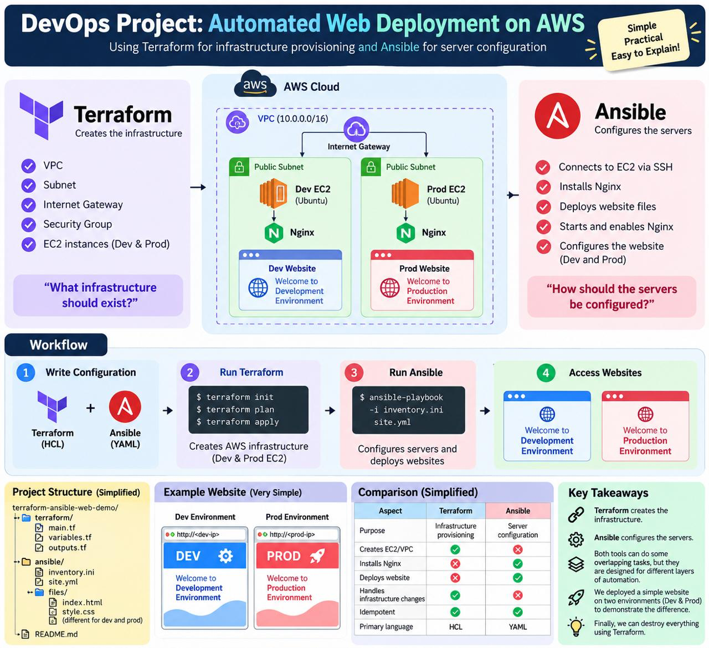

# Automated Multi-Environment Web Deployment on AWS

### Infrastructure as Code with Terraform & Configuration Management with Ansible

---

## 📌 Project Overview

In modern Cloud DevOps engineering, building scalable and reliable systems requires a clear separation between **Infrastructure Provisioning** and **Configuration Management**:

1. **Terraform (Infrastructure Layer):** Answers the question *"What infrastructure should exist?"* by declaratively provisioning the core cloud architecture on Amazon Web Services (AWS)—including the Virtual Private Cloud (VPC), public subnets across availability zones, internet gateways, routing tables, security firewalls, and EC2 virtual machines.
2. **Ansible (Configuration Layer):** Answers the question *"How should the servers be configured?"* by connecting agentlessly over SSH to install the Nginx web server, manage system services, and deploy environment-specific web applications.

To demonstrate real-world deployment workflows, this project provisions two completely isolated environments:
* **Development (Dev):** Staging environment hosted on `16.176.204.1` with a cyan/blue developer telemetry dashboard.
* **Production (Prod):** Live production cluster on `3.25.242.241` with a hardened dark-mode UI and pulsating operational health indicator.

---

## 🏗️ Architecture & Workflow



### Architectural Flow:
1. **Network Boundary:** A dedicated AWS VPC (`10.0.0.0/16`) in region `ap-southeast-2` (Sydney) provides network isolation.
2. **Subnet Segmentation:**
   - **Dev Subnet** (`10.0.1.0/24`) in Availability Zone `ap-southeast-2a`.
   - **Prod Subnet** (`10.0.2.0/24`) in Availability Zone `ap-southeast-2b`.
3. **Public Ingress/Egress:** An AWS Internet Gateway (IGW) attached to the VPC routes all external internet traffic (`0.0.0.0/0`) via a custom Public Route Table.
4. **Firewall Protection:** An AWS Security Group (`devops-ia-web-sg`) restricts incoming traffic to Port 22 (SSH for Ansible management) and Port 80 (HTTP for public web access).
5. **Compute Layer:** Two Amazon Linux 2023 EC2 instances (`t3.micro`) run inside their respective subnets.
6. **Web Server & Reverse Proxy:** Nginx listens on port 80, serving static web assets from `/usr/share/nginx/html/`.

---

## 🌐 Live Deployment Endpoints

| Environment | Public IP | Direct URL | Subnet CIDR | Availability Zone |
|---|---|---|---|---|
| **Development** | `16.176.204.1` | [http://16.176.204.1](http://16.176.204.1) | `10.0.1.0/24` | `ap-southeast-2a` |
| **Production** | `3.25.242.241` | [http://3.25.242.241](http://3.25.242.241) | `10.0.2.0/24` | `ap-southeast-2b` |

---

## 📁 Repository Structure

```text
IA_Terraform_ansible/
├── terraform/                   # Infrastructure as Code (Terraform)
│   ├── main.tf                  # VPC, Subnets, IGW, RT, SG, Key Pair & EC2s
│   ├── variables.tf             # Input variables (Region, CIDRs, Instance Type)
│   ├── outputs.tf               # Exported public IPs and instance IDs
│   └── terraform.tfstate        # State file tracking deployed AWS infrastructure
├── ansible/                     # Configuration Management (Ansible)
│   ├── inventory.ini            # Host definitions for Dev and Prod servers
│   └── site.yml                 # Playbook: DNF update, Nginx setup, website deploy
├── files/                       # Static website source code
│   ├── dev/                     # Development landing page (HTML/CSS)
│   │   ├── index.html
│   │   └── style.css
│   └── prod/                    # Production landing page (HTML/CSS)
│       ├── index.html
│       └── style.css
├── .gitignore                   # Ignores *.tfstate, keys, and cache files
├── image.png                    # Project architecture & workflow diagram
└── README.md                    # Project documentation
```

---

## 🔄 Terraform vs. Ansible — Comprehensive Comparison

A core objective of this project is understanding where Terraform ends and Ansible begins.

| Evaluation Criterion | HashiCorp Terraform | Red Hat Ansible |
|---|---|---|
| **Primary Domain** | **Infrastructure Provisioning (IaC)** | **Configuration Management (CM)** |
| **Focus Question** | *"What infrastructure should exist?"* | *"How should servers be configured?"* |
| **Configuration Language** | HCL (HashiCorp Configuration Language) | YAML (Human-readable data serialization) |
| **Execution Paradigm** | **Purely Declarative** (You describe the end state; Terraform figures out how to create it) | **Hybrid / Task-Based Declarative** (Step-by-step tasks using declarative modules) |
| **State Management** | **Stateful:** Tracks real-world cloud state via `terraform.tfstate` | **Stateless:** Inspects host state live at runtime; no state file |
| **Connection Method** | Cloud Provider REST APIs via AWS SDK | Secure Shell (OpenSSH) with Python execution |
| **Agent Requirement** | Agentless | Agentless |
| **Provisioning VPC/EC2/SG** | ✅ **Native Strength** | ❌ Clunky and not intended for complex cloud topology |
| **Software/Package Management** | ❌ Limited (requires hacky `user_data` scripts) | ✅ **Native Strength** (`dnf`, `apt`, `yum`) |
| **Application Deployment** | ❌ Not designed for software releases | ✅ **Native Strength** (`copy`, `template`, `git`) |
| **Service Lifecycle Management**| ❌ Cannot monitor OS services natively | ✅ Native module (`systemd`, `service`) |
| **Idempotency** | ✅ Yes (Applies only the diff between code & cloud) | ✅ Yes (Tasks only change state if the target is out of sync)|
| **Teardown & Cleanup** | ✅ Single command: `terraform destroy` | ❌ Complex (Must write explicit uninstall tasks) |

### Key Takeaway:
> **Terraform and Ansible are complementary, not competing.** Terraform provisions the empty servers, networks, and firewalls. Once the servers are reachable, Ansible takes over to configure packages, users, security baselines, and applications. Combining them provides a complete automated DevOps pipeline.

---

## 🚀 Step-by-Step Execution Guide (Reproducibility)

Follow these steps to reproduce this deployment from scratch:

### 1. Prerequisites Setup
```bash
# Verify tools are installed
terraform --version
ansible --version
aws --version

# Configure AWS Credentials
aws configure

# Generate SSH key pair for EC2 access
ssh-keygen -t rsa -b 2048 -f ~/.ssh/devops_aws_key -N ""
chmod 400 ~/.ssh/devops_aws_key
```

### 2. Provision Infrastructure with Terraform
```bash
cd terraform

# Initialize provider plugins
terraform init

# Preview resource creations
terraform plan

# Apply infrastructure to AWS
terraform apply -auto-approve
```
*Note the public IPs printed in `terraform output`.*

### 3. Configure Servers & Deploy Websites with Ansible
```bash
cd ../ansible

# Verify SSH connectivity to both EC2 instances
ansible -i inventory.ini all -m ping

# Run the deployment playbook
ansible-playbook -i inventory.ini site.yml
```

### 4. Verify in Browser
- Open Dev: `http://<dev_public_ip>`
- Open Prod: `http://<prod_public_ip>`

---

## 🧹 Resource Teardown (Clean-Up)

To prevent unwanted cloud billing and conserve AWS credits after demonstration, tear down all provisioned AWS infrastructure with a single command:

```bash
cd terraform
terraform destroy -auto-approve
```

Terraform will read `terraform.tfstate` and cleanly destroy all 9 AWS resources in reverse dependency order:
1. Terminate Dev & Prod EC2 instances
2. Delete Security Group and Key Pair
3. Dissociate and delete Route Table & Subnets
4. Detach and delete Internet Gateway
5. Delete the VPC

---

## 👥 Authors & Academic Context

* **Developer:** Aryan Raut
* **Course:** DevOps (Semester VII)
* **Institution:** K.J. Somaiya College of Engineering, Mumbai
